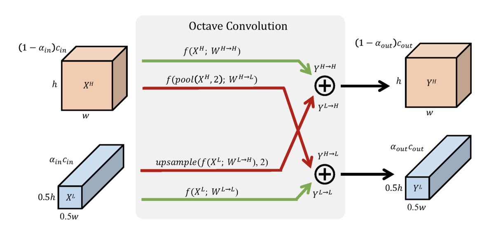

# OctaveConv.pytorch
A Pytorch Implementation for the paper [Drop an Octave: Reducing Spatial Redundancy in Convolutional Neural Networks with Octave Convolution](https://arxiv.org/abs/1904.05049).



## Usage
```python
from models import octave_resnet50

model = octave_resnet50(num_classes=10)
```

## Benchmark
* Input size of model is set to 224.
* The CPU and GPU time is the averaged inference time of 100 runs (there are also 20 warm-up runs before measuring) with batch size 1.
* Hardware configuration for benchmarking:
```
CPU: Intel(R) Core(TM) i7-7700HQ CPU @ 2.80GHz
GPU: GeForce GTX 1050 Mobile, CUDA 9.0
```

| Model | CPU time (Original version) | GPU time (Original version) | CPU time (Octave version) | GPU time (Octave version) |
|:-:|:-:|:-:|:-:|:-:|
| ResNet18 | 40ms | 5ms | 63ms | 9ms |
| ResNet34 | 67ms | 9ms | 104ms | 17ms |
| ResNet50 | 104ms | 13ms | 168ms | 24ms |
| ResNet101 | 189ms | 22ms | 304ms | 51ms |
| ResNet152 | 266ms | 32ms | 479ms | 79ms |


## Reference
Inspired by the MXNet implementation [here](https://github.com/terrychenism/OctaveConv).
